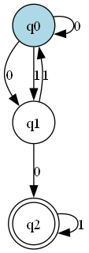
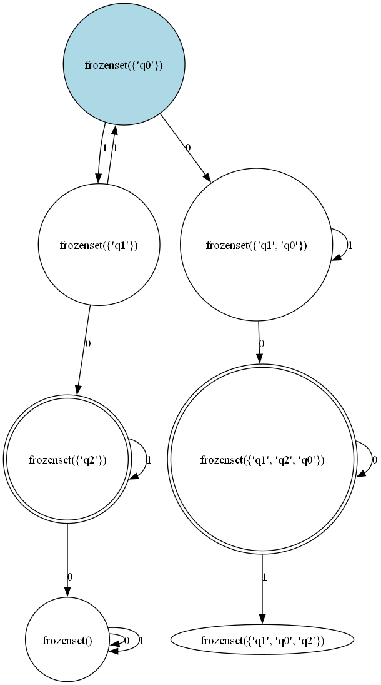
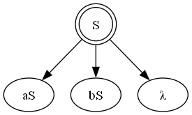
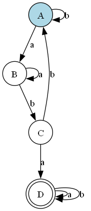
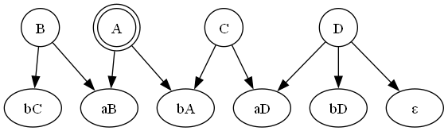

# ToC EL

## Example Images

Visualizing DFA

Visualizing NFA

Visualizing NFA with Epsilon Transitions

DFA Path for String 1

DFA Path for String 2

NFA to DFA Conversion

Regular Grammar Visualization

RG to DFA Conversion

DFA Visualization for language containing substring 'aba'

DFA to RG for language containing substring 'aba'

